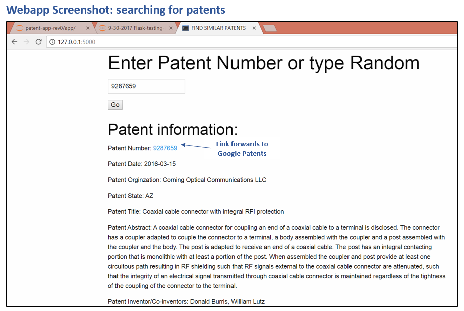
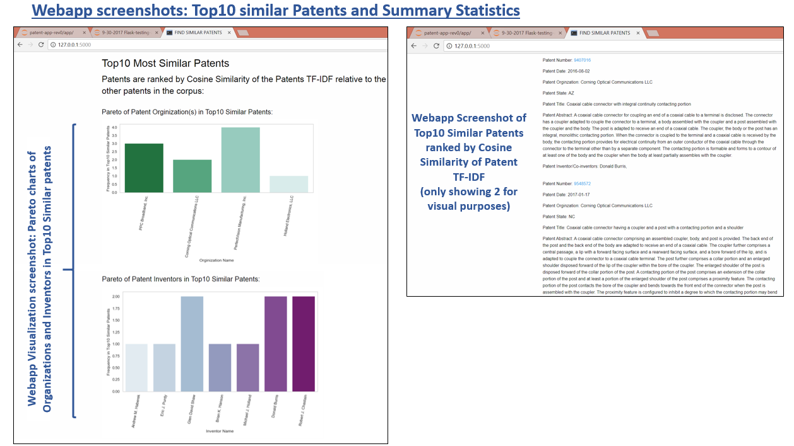

# Introduction & Motivation #
* Patenting inventions involves significant research of finding and learning from existing patents that might be similar to your work
* A Webapp that allows users to search for patents, to find similar patents based on textual content and to explore how patents are connected together by visualizing their citation network will help innovators during their research process. 
 
# Project Objectives #
1. Develop Webapp that allows users to search for patents and to find like-patents based on the similarity of their textual content. 
2. Rank like-patents by the cosine similarity of the patents TF-IDF
3. Webapp should provide summary statistics of the like-patents in the form of visualizations 
4. Webbap app should use graph analysis to visualize the patent citation network 

# The Process #

# Results #
## Patent Network Statistics: ##
Histogram plots below show the number of patents cited (right; outgoing citations) and the number of times patents were cited by other patents (left; incoming citations)

Contour plot of the United States map (top) and bar plot (bottom) showing Total Patents from each state/territory between 2010 – 2017 

## Webapp Screenshots ##

# Next Steps #
* Enable Webapp to use graph analysis to visualize patent citation network
* Launch Flask Webapp that is publicly accessible 

